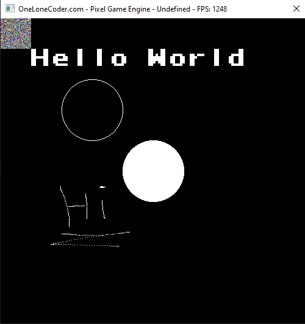

# OLC - J - PixelGameEngine

Simply out of love for game development, java and the OLC channel.

Uses the new FFM API introduced in Java 22. Rough testing shows no significant performance impact,
at least the example program (random pixels all around) gives the same amount of FPS in Java as it does in C.

Feel free to reach out, especially for alternative OS support!


Simple implementation example:

```java
import org.kurodev.jpixelgameengine.draw.Pixel;
import org.kurodev.jpixelgameengine.impl.ffm.PixelGameEngine;
import org.kurodev.jpixelgameengine.input.HWButton;
import org.kurodev.jpixelgameengine.pos.Vector2D;

public class PixelGameEngineImpl extends PixelGameEngine {
    public PixelGameEngineImpl(int width, int height) {
        super(width, height);
    }

    @Override
    public boolean onUserCreate() {
        return true;
    }

    @Override
    public boolean onUserUpdate(float delta) {
        if (!isFocussed()) {
            return true;
        }
        int size = 50;
        for (int y = 0; y < size; y++) {
            for (int x = 0; x < size; x++) {
                draw(x, y, new Pixel((int) (Math.random() * 255), (int) (Math.random() * 255), (int) (Math.random() * 255)));
            }
        }

        HWButton mouse = getKey(MouseKey.LEFT);
        if (mouse.isHeld()) {
            Vector2D<Integer> pos = getWindowMousePos();
            draw(pos, Pixel.WHITE);
        }
        drawString(50, 50, "Hello World", Pixel.WHITE, 4);
        drawCircle(150, 150, 50, Pixel.WHITE);
        fillCircle(250, 250, 50, Pixel.WHITE);
        return true;
    }

    public static void main(String[] args) {
        PixelGameEngine wrapper = new PixelGameEngineImpl(500, 500);
        wrapper.start();
    }
}
```

